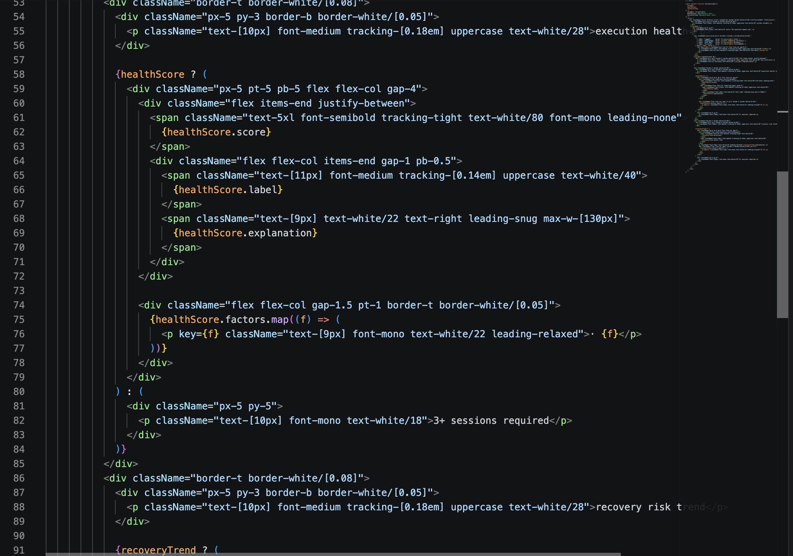
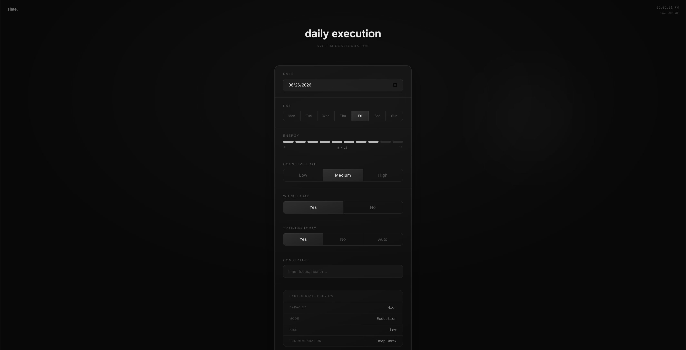
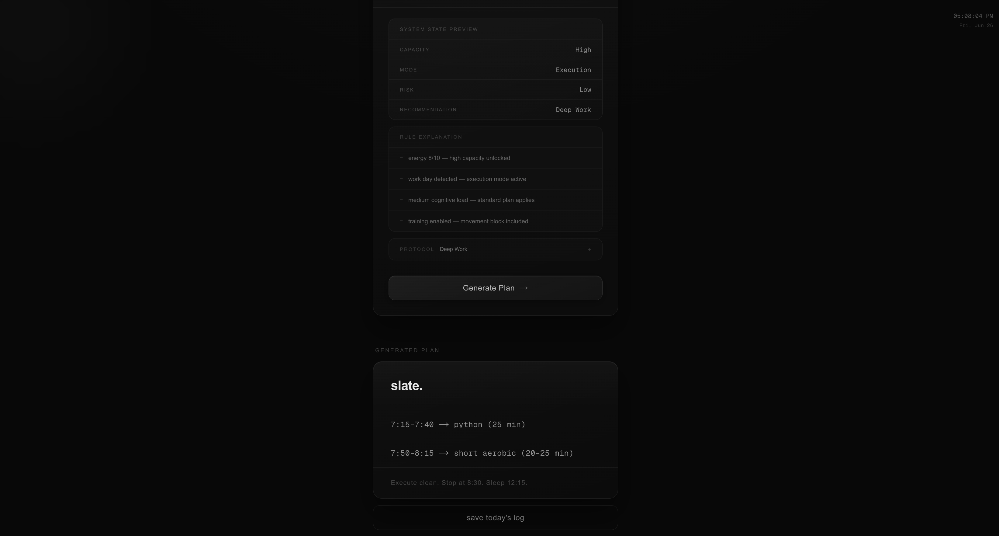
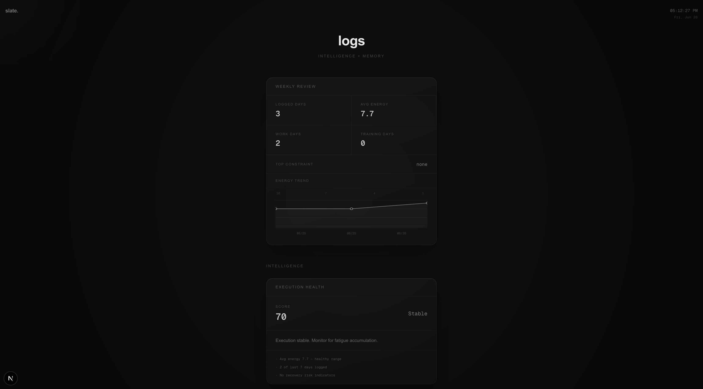
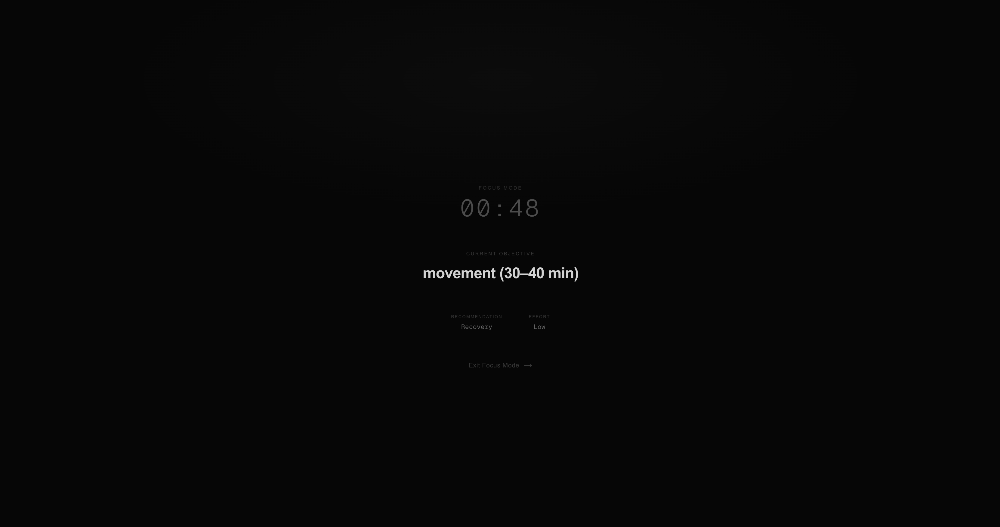

# slate.

**Adaptive Execution Intelligence Platform**

🔗 **Live Demo:** https://slate-xi-vert.vercel.app

> Capacity → Rules → Execution

A capacity-aware decision-support platform that helps people determine what they realistically have the capacity to execute, rather than simply tracking tasks.

<!-- Place hero screenshot at: docs/images/dashboard.png -->
<p align="center">
  
</p>

---

## Philosophy

Slate follows a simple framework:

```
Capacity
↓
Rules
↓
Execution
```

The system first evaluates the user's current state, applies rule-based recommendations, and returns an executable plan that respects recovery, workload, and cognitive constraints.

Low capacity is not failure. It triggers a smaller, intentional execution protocol.

---

## Screenshots

### Dashboard


*OS-inspired interface featuring recovery intelligence, system insights, and execution analytics.*

---

### Daily Execution — Configuration


*Configure energy, workload, and constraints to generate capacity-aware recommendations.*

---

### Daily Execution — Generated Plan


*Slate translates system state into actionable recommendations and structured execution plans.*

---

### Logs & Analytics


*Historical logging, behavioral trends, and execution health analytics that surface patterns across recovery and workload.*

---

### Focus Mode


*An immersive, distraction-reduced environment that surfaces a single objective and encourages deliberate execution.*

---

## Features

### Command Center

* Premium operating system-inspired dashboard
* System online indicator
* Global clock
* Quick actions
* System insights
* Energy trends
* Recent activity
* Next Action card

### Daily Execution

* Auto-filled date and day
* Interactive energy selector
* Cognitive load tracking
* Work and training constraints
* Live system state preview
* Rule explanation panel
* Dynamic recommendation protocol
* Plan generation
* Log saving
* Toast notifications

### Intelligence

* Execution health score
* Recovery risk trend analysis
* Recommendation distribution insights
* Execution pattern detection

### Logs

* Local execution memory
* Weekly review panel
* Average energy metrics
* Work and training summaries
* Energy trends
* Saved plans and historical logs

### Focus Mode

* Distraction-free execution environment
* Current objective display
* Recommendation summary
* Live session timer
* Exit and completion actions

### System Features

* Command Palette (Cmd+K / Ctrl+K)
* Toast notification system
* Premium dark OS aesthetic
* Glass panels and ambient backgrounds
* Boot animation
* Cursor aura

---

## Technology Stack

* Next.js (App Router)
* React
* TypeScript
* Tailwind CSS
* localStorage persistence

---

## Project Structure

```
app/
components/
lib/
public/
docs/images/
ARCHITECTURE.md
DECISIONS.md
TODO.md
```

---

## Current Version

Slate v0.6 — Adaptive Execution Intelligence

- Shared types extracted into `types/`
- Business logic centralized in `lib/`
- Frontend performance audited and optimized
- Homepage decomposed into `components/home/`
- Daily Execution decomposed into `components/daily/`
- Shell components organized into `components/shell/`
- Intelligence layer: health score, recovery trends, pattern detection, recommendation insights
- Focus Mode, command palette, and toast notifications added

---

## Next

Slate v0.7 — Completion Tracking

---

## Roadmap

### v0.7 — Completion Tracking

* Planned vs executed comparison
* Completion status tracking
* Adherence metrics

### v0.8 — Cloud Sync

* User accounts
* Cross-device memory
* Execution log backups

### v0.9 — Domain Modules

* School
* Training
* Finance
* Career
* Recovery

### v1.0 — Agent Layer

* Execution Agent
* School Agent
* Training Agent
* Finance Agent
* Recovery Agent

---

## Why I Built Slate

Working in healthcare and studying health informatics exposed me to a recurring problem: most productivity systems assume capacity is constant.

In reality, workload, cognitive fatigue, recovery, and competing demands fluctuate every day.

Slate was built as an adaptive execution system that treats energy and constraints as first-class inputs and recommends the minimum effective plan for the current state instead of encouraging maximum output.

---

Built by Andrew Balacy
